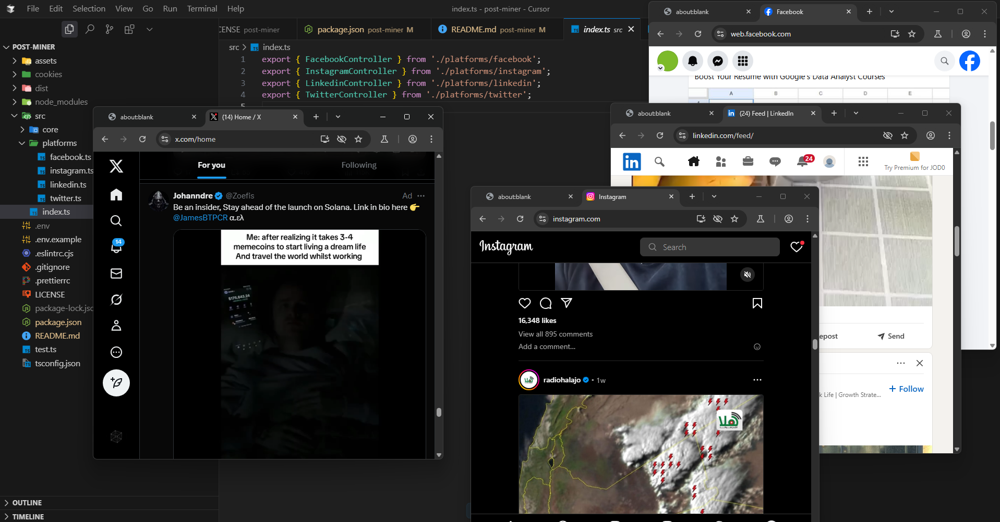

<p align="center">
  
</p>

<h1 align="center">Post Miner</h1>

<p align="center">
  <strong>Automation SDK for multi-platform login & scraping using Puppeteer.</strong><br />
  Supports: Facebook, Instagram, LinkedIn, Twitter and more SOON
</p>

<p align="center">
  <a href="https://www.npmjs.com/package/post-miner"></a>
  <a href="https://github.com/CP0004/post-miner"></a>
  <a href="https://github.com/CP0004/post-miner/blob/main/LICENSE"></a>
</p>

---

## 🚀 Features

- ✅ **Multi-Platform Support**: Facebook, Instagram, LinkedIn, Twitter
- 🔐 **Automated Login**: Credentials or persistent sessions
- 🍪 **Cookie Management**: Save/load across runs
- 🕵️‍♂️ **Stealth Mode**: Puppeteer-extra for anti-bot detection
- 📦 **Simple API**: Same interface for all platforms

---

## 📦 Installation

```bash
npm install post-miner
# or
yarn add post-miner
```

---

## ⚙️ Configuration

Use `.env` file or environment variables:

```env
FACEBOOK_EMAIL=""
FACEBOOK_PASSWORD=""

INSTAGRAM_EMAIL=""
INSTAGRAM_PASSWORD=""

TWITTER_EMAIL=""
TWITTER_PASSWORD=""

LINKEDIN_EMAIL=""
LINKEDIN_PASSWORD=""
```

---

## 🧑‍💻 Usage

```ts
import { FacebookController } from 'post-miner';
import dotenv from 'dotenv';
dotenv.config();

const fb = new FacebookController('./cookies/facebook.json', {
  email: process.env.FACEBOOK_EMAIL!,
  password: process.env.FACEBOOK_PASSWORD!
});

await fb.init();

const page = fb.getPage();
await page.goto('https://www.facebook.com/me');

await fb.close();
```

---

## 🧩 Other Platforms

```ts
new InstagramController('./cookies/instagram.json', { email, password });
new LinkedinController('./cookies/linkedin.json', { email, password });
new TwitterController('./cookies/twitter.json', { email, password });
```

All have the same `.init()`, `.getPage()`, `.close()` API.

---

## 🛠️ Development

```bash
npm run dev      # Live dev mode
npm run build    # Build to dist/
npm run lint     # Lint code
npm run format   # Format code
```

---

## 🗂️ Project Structure

```
src/
├── core/           # Shared logic: browser, cookies
├── platforms/      # Controllers: Facebook, etc.
├── index.ts        # Entry point
```
---

## 📄 License

MIT © [mohamad-aljeiawi](https://www.linkedin.com/in/mohamad-aljeiawi/)